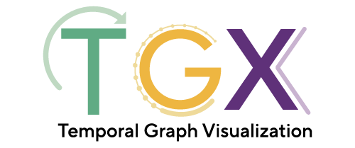

<!-- # TGX -->

# TGX Community Contribution Guidelines

TGX is a community driven project and we hope to continue to add new features to it so that it is useful for a wide range of analysis and scenarios. This guide documents the best way to make various types of contribution to TGX, including what is required before submitting a code change. 

Contributing to TGX is more than submitting code changes, we also welcome new research suggestions, inviting new users, testing releases and improving the documentation. Raising issues on Github to point out any issues or directions of improvement are also welcome. 

## Reporting issues on Github

Creating issues on Github is a useful way to manage problems and identify priorities. When possible, please add appropriate tags to the issue you are creating. For example, if it is related to the documentation website or error in documentation, you can include the `documentation` tag. If it is related to package installation, you can add the `install` tag. Overall, combining multiple issues that are related into a single one to report is also helpful to avoid trackig too many issues. 

### Bugs

Bug reports are useful when they are accompanied by ways to understand and reproduce the bug. When reporting a bug, try to include detailed steps on how you encountered the bug and how to reproduce it. If you would like to propose a fix to the bug, feel free to link it to a pull request on the issue as well.

### Feedbacks and Improvements

Feedbacks and improvements on TGX are welcome. If you would like to see new temporal graph statistics or visualization added, feel free to reach out directly by [email](shenyang.huang@mail.mcgill.ca) or create an issue on Github. You are of course more than welcome to add visualization and statistics from your own paper as well. 

## Preparing code changes

in construction. 