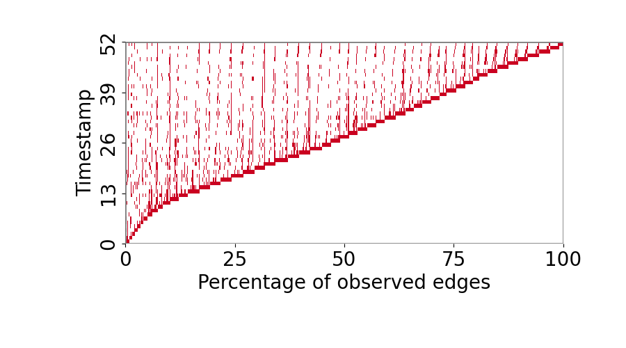
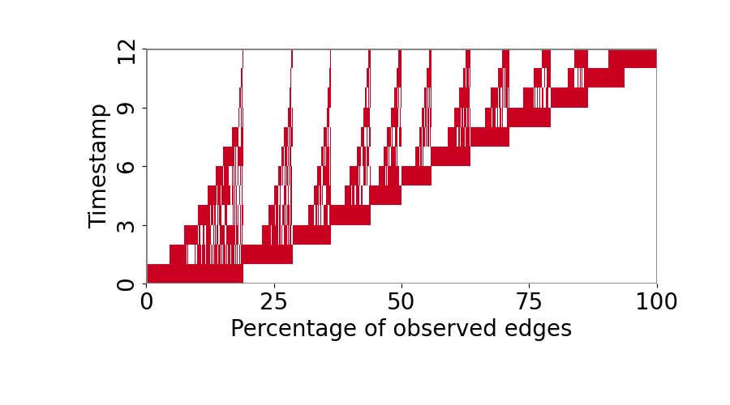
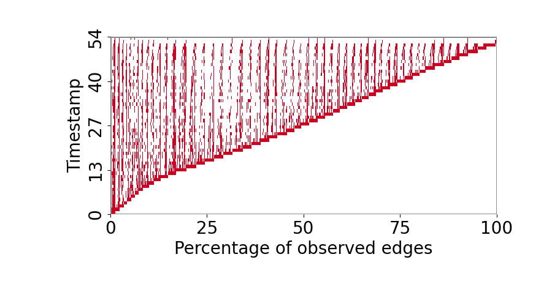

## TET Plots

### Reddit

<figure markdown>
{ width="500"}
</figure>

### MOOC

<figure markdown>
{ width="500"}
</figure>

### LastFM

<figure markdown>
{ width="500"}
</figure>

### Enron

<figure markdown>
{ width="500"}
</figure>

### Social Evo

<figure markdown>
{ width="500"}
</figure>

### UCI

<figure markdown>
{ width="500"}
</figure>

### Flights

<figure markdown>
{ width="500"}
</figure>

### Can. Parl.

<figure markdown>
{ width="500"}
</figure>

### US Legis

<figure markdown>
{ width="500"}
</figure>

### UN Vote

<figure markdown>
{ width="500"}
</figure>

### Contacts

<figure markdown>
{ width="500"}
</figure>

### tgbl-wiki

<figure markdown>
{ width="500"}
</figure>

### tgbl-review

<figure markdown>
{ width="500"}
</figure>

### tgbl-coin

<figure markdown>
{ width="500"}
</figure>

### tgbl-comment

<figure markdown>
<!-- { width="500"} -->
</figure>

### tgbl-flight

<figure markdown>
{ width="500"}
</figure>

### tgbn-trade

<figure markdown>
{ width="500"}
</figure>

### tgbn-genre

<figure markdown>
{ width="500"}
</figure>

### tgbn-reddit

<figure markdown>
{ width="500"}
</figure>